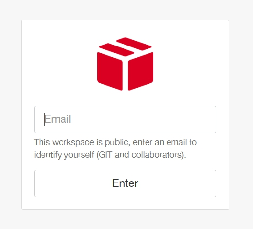

# Codespaces

## How do you use Codespaces IDE in your machine?

### Docker Installation
We assume that you have installed Docker-Engine and Docker-Compose in your machine. If not, please follow the below mentioned references to get started with Docker and Docker-Compose.
  * [Docker-Engine Installation Tutorial](https://docs.docker.com/engine/installation/)
  * [Docker-Compose Installation Tutorial](https://docs.docker.com/compose/install/)

### Start Codespaces IDE

After installing Docker-Engine and Docker-Compose, change directory into the corresponding tool you want to learn. For example, let us assume that you want to learn puppet. In that case,

```
cd codespaces-puppet
```

Then all you need to do is to run

```
docker-compose up -d
```

This single command will initialize your Codespaces IDE.

### Use Codespaces IDE

To use Codespaces IDE,

  * Open your browser.
  * Visit your machine's IP with port 8000. (Ex. http://192.168.0.60:8080)
  * You will be asked for your e-mail address. Enter it and you are good to go.



  * Now you will be presented with the Codespaces IDE console.


